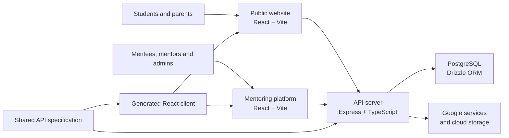

# Acadea

**A live mentoring and university-application product built from a real service
need.**

[Visit Acadea](https://acadea.org/) ·
[Open the mentoring platform](https://app.acadea.org/) ·
[LinkedIn](https://www.linkedin.com/company/acadeaorg)


Acadea helps students plan and manage applications to universities abroad. The
repository contains the public website, the mentor/mentee platform, the API and
the shared TypeScript packages behind the deployed service.

This is not a tutorial repository. It represents sustained product work across
a public bilingual website, operational workflows, structured application data,
booking and communication, and external-service integrations.

## My role

I founded Acadea and led the product from service concept to a deployed system.
My contribution is best understood as **founder and product lead**, not as a
claim of unaided software engineering:

- translated business and user needs into journeys, requirements and acceptance criteria;
- defined the mentor, mentee and administrator workflows and their business rules;
- prioritised features and integrations around the way the service operates;
- tested production behaviour and iterated on releases and deployment decisions;
- used AI-assisted development extensively to turn those decisions into working software.

I remain accountable for the problem framing, product choices, domain logic,
validation and operational outcome. AI assistance is disclosed because it is an
important part of how the product was delivered—not something this portfolio is
intended to obscure.

## Product scope

- **Bilingual public site** with service information, consultation booking,
  scholarship flows, SEO/prerendering and a structured knowledge base.
- **Mentoring platform** for mentees, mentors and administrators, including
  application planning, assignments, document workflows and progress tracking.
- **TypeScript API** for authentication, platform workflows, contact and booking
  operations, file handling and third-party integrations.
- **PostgreSQL data layer** modelled with Drizzle ORM.
- **Shared API contract** with generated validation and React client packages.
- **Operational integrations** with selected Google services and cloud storage.


## Architecture



| Workspace | Responsibility |
| --- | --- |
| `artifacts/acadea-website` | Public Polish/English website and knowledge base |
| `artifacts/acadea-platform` | Mentee, mentor and administrator application |
| `artifacts/api-server` | Express API and integration layer |
| `lib/db` | Database schema and data access |
| `lib/api-spec` | Shared API contract and client-generation source |
| `lib/api-zod` | Runtime validation generated from the contract |
| `lib/api-client-react` | Generated React API client |

## Technology

TypeScript · React · Vite · Express · PostgreSQL · Drizzle ORM · pnpm workspaces
· Google Cloud Run · Cloudflare · OpenAPI-derived clients

## Repository checks

The repository uses Node.js 22+ and pnpm. A fresh dependency installation and
the same checks used in CI can be run with:

```bash
corepack enable
pnpm install --frozen-lockfile
pnpm typecheck
pnpm -r --if-present run build
```

The workspace currently relies on full TypeScript checks and production builds
as its automated quality gates. It does not yet have a comprehensive automated
application-test suite; production flows are also tested manually. That is a
known engineering limitation rather than an omitted claim.

Running the complete product locally additionally requires private environment
configuration and access to external services. Those credentials, operational
data and user records are intentionally not part of this public repository.

## Public-repository policy

- Environment files, tokens, credentials and local databases are ignored.
- Student, mentor and operational records are never included.
- `AGENTS.md` and `.agents/memory` are intentionally tracked so the same
  AI-assisted development context is available across cloned repositories on
  multiple devices. They do not contain credentials or user records.
- The repository is source code for portfolio and product transparency; it is
  not a ready-made Acadea production deployment.

## Licence and permitted use

**Copyright © 2026 Mateusz Klepacki. All rights reserved.** This repository is
publicly visible for portfolio evaluation only; it is not open source. No
permission is granted to copy, modify, distribute, deploy, host, sublicense,
sell, create derivative works from, or otherwise use the code or Acadea product
materials for commercial or non-commercial purposes.

See the [proprietary source-code notice](LICENSE) for the complete terms.
Third-party dependencies remain governed by their respective licences.
