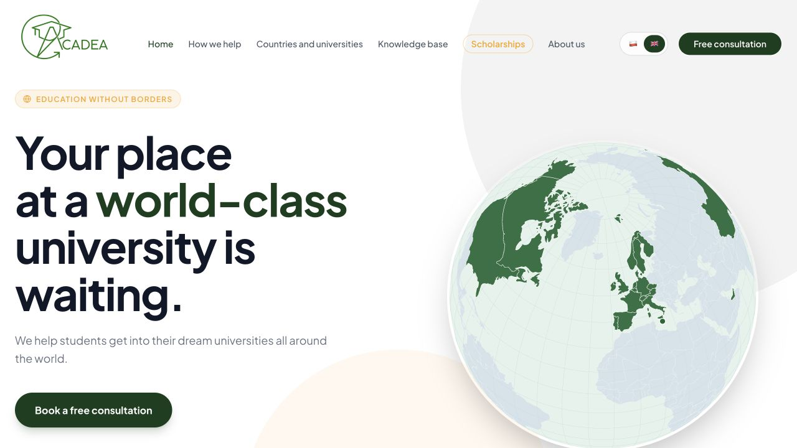
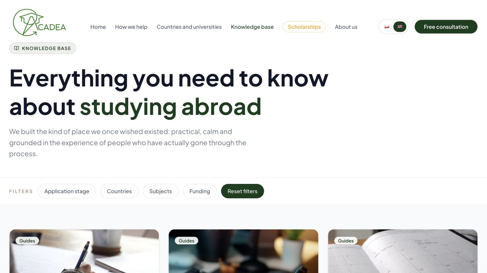
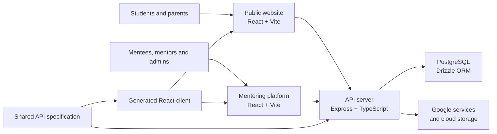

# Acadea

Acadea is a live bilingual mentoring and university-application service that
has supported more than 200 students and contributed to over 75 university
placements. This repository contains the public website, mentor/mentee
platform, TypeScript API, PostgreSQL data layer and shared packages behind the
deployed product.

[Visit Acadea](https://acadea.org/) ·
[Open the mentoring platform](https://app.acadea.org/) ·
[LinkedIn](https://www.linkedin.com/company/acadeaorg)



## My contribution

As co-founder, I:

- translated student, mentor and administrative needs into product requirements and acceptance criteria;
- defined workflows and business rules for application planning, documents, scheduling and progress tracking;
- prioritised releases and integrations around the organisation’s operational needs;
- tested production behaviour and iterated the deployed service.

The implementation was developed with extensive AI assistance. I specified the
required workflows and business rules, reviewed and tested the resulting
behaviour, and managed product iterations and deployment. I therefore present
the repository as evidence of product delivery and technical problem-solving,
not as a claim that I wrote every line unaided.

## Product scope

- **Bilingual public site** with service information, consultation booking,
  scholarship flows, SEO/prerendering and a structured knowledge base.
- **Mentoring platform** for mentees, mentors and administrators, including
  application planning, assignments, document workflows and progress tracking.
- **TypeScript API** for authentication, platform workflows, contact and booking
  operations, file handling and third-party integrations.
- **PostgreSQL data layer** modelled with Drizzle ORM.
- **Shared API contract** with generated validation and React client packages.
- **Operational integrations** with selected Google services and cloud storage.



## Architecture



| Workspace | Responsibility |
| --- | --- |
| `artifacts/acadea-website` | Public Polish/English website and knowledge base |
| `artifacts/acadea-platform` | Mentee, mentor and administrator application |
| `artifacts/api-server` | Express API and integration layer |
| `lib/db` | Database schema and data access |
| `lib/api-spec` | Shared API contract and client-generation source |
| `lib/api-zod` | Runtime validation generated from the contract |
| `lib/api-client-react` | Generated React API client |

## Technology

TypeScript · React · Vite · Express · PostgreSQL · Drizzle ORM · pnpm workspaces
· Google Cloud Run · Cloudflare · OpenAPI-derived clients

## Repository checks

The repository uses Node.js 22+ and pnpm. A fresh dependency installation and
the same checks used in CI can be run with:

```bash
corepack enable
pnpm install --frozen-lockfile
pnpm typecheck
pnpm -r --if-present run build
```

Automated checks currently cover TypeScript validation and production builds,
supplemented by manual testing of the principal production workflows. Local
execution requires private environment configuration and access to external
services; credentials and user data are not included.

## Licence

The source is publicly visible for portfolio review but is not open source. See
[LICENSE](LICENSE) for the applicable terms.
